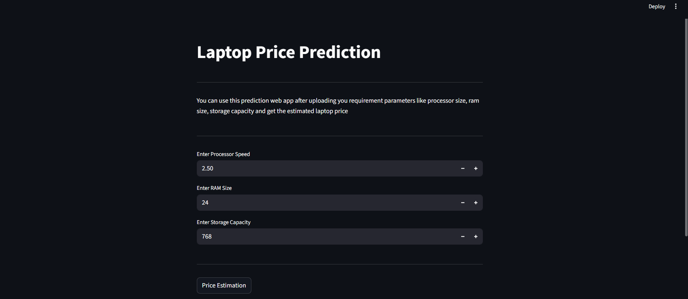

# Laptop Price Prediction Web App
This is a simple machine learning web application built with Streamlit that predicts the estimated price of a laptop based on its key specifications. The app uses a pre-trained Random Forest Regressor model to provide a quick price estimation.

# Image 

# How to Set Up and Run the App
Follow these steps to get the app running on your local machine.

Step 1: Install Dependencies
First, you need to install all the required Python libraries. Open your terminal or command prompt, navigate to the project directory, and run the following command. This will install Streamlit, NumPy, and Joblib.

pip install -r requirements.txt

Step 2: Run the Application
Once the dependencies are installed, you can start the Streamlit application with a single command.

streamlit run app.py

After running the command, your default web browser will automatically open a new tab with the Laptop Price Prediction web app.

# How to Use the App
The web app has a user-friendly interface:

Enter the values for "Processor Speed," "RAM Size," and "Storage Capacity."

Click the "Price Estimation" button.

The estimated price will be displayed on the screen and we can see .